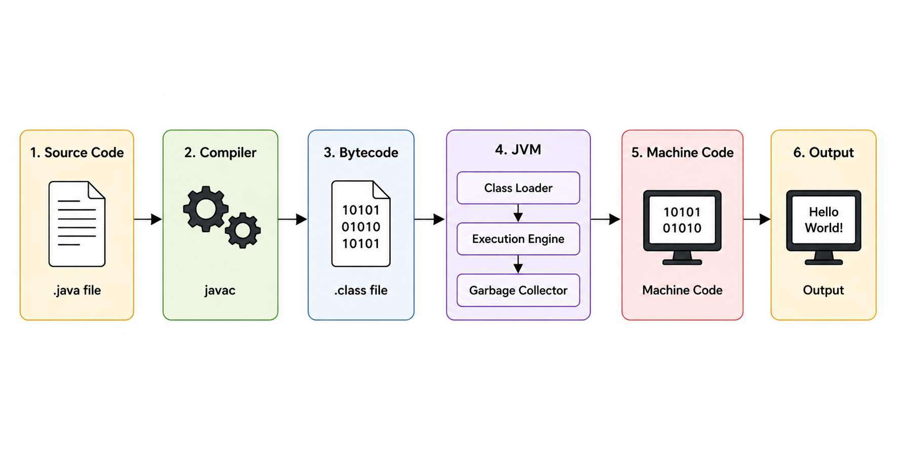
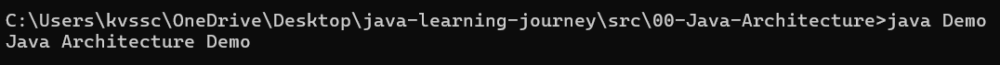
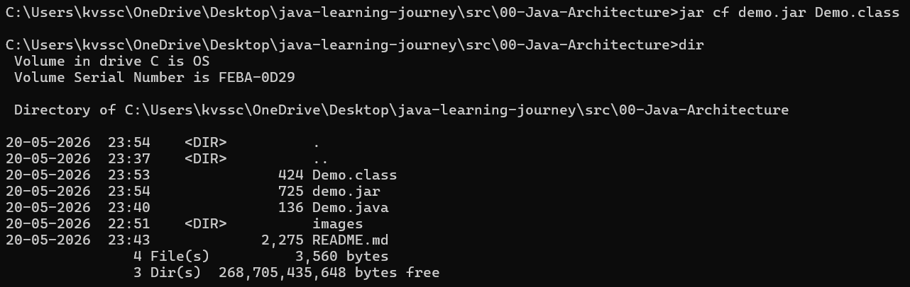

# Java Architecture

Java follows the principle:

```text
Write Once, Run Anywhere (WORA)
```
## Java Execution Flow



---

# Main Components of Java Architecture

## 1. JDK (Java Development Kit)

JDK is used to develop and run Java programs.

### JDK Includes
- JRE
- JVM
- Compiler (`javac`)
- Development tools

### Important Command

Compile Java program:

```bash
javac Demo.java
```
This converts:
```text
Demo.java → Demo.class
```

### Some JDK Tools
- `javac` → Compiler
- `javadoc` → Documentation generator
- `jar` → Creates JAR files
- `jdb` → Debugger

---

## 2. JRE (Java Runtime Environment)

JRE provides the environment required to run Java applications.

### Features
- Contains JVM and libraries
- Used only for running Java programs
- Cannot compile Java code

### Key Point

```text
JDK = JRE + Development Tools
```

---

## 3. JVM (Java Virtual Machine)

JVM executes Java bytecode and converts it into machine code.

- JVM is the heart of Java
### Responsibilities
- Loads class files
- Executes bytecode on any OS
- Manages memory, class loading, program execution
- Makes Java platform independent

### Command used:

```bash
java Demo
```
Output:



### JVM Components
- Class Loader
- Memory Areas
- Execution Engine
- Garbage Collector

---

## 4. JIT  (Just In Time Compiler)

- Part of JVM
- Converts bytecode into native machine code
- Improves Execution Speed

---
## 5. Garbage Collector

Garbage Collector:
- Automatically removes unused objects
- Frees memory
- Helps in memory management

---

## 6. JAR File

JAR (Java Archive) is used to package multiple Java class files into a single file.

- Easy distribution and deployment
### Create JAR

```bash
jar cf demo.jar Demo.class
```
### After Execution



---
## Conclusion

Java achieves platform independence using bytecode and JVM.

- JDK is used for development
- JRE provides runtime environment
- JVM executes bytecode
- JIT improves performance